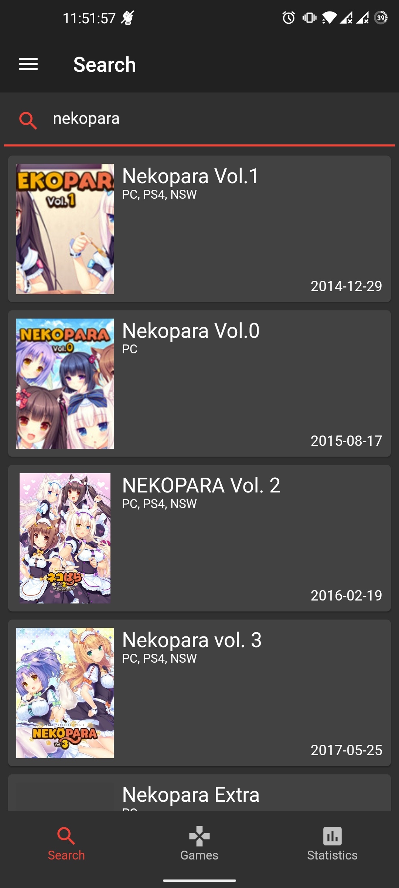
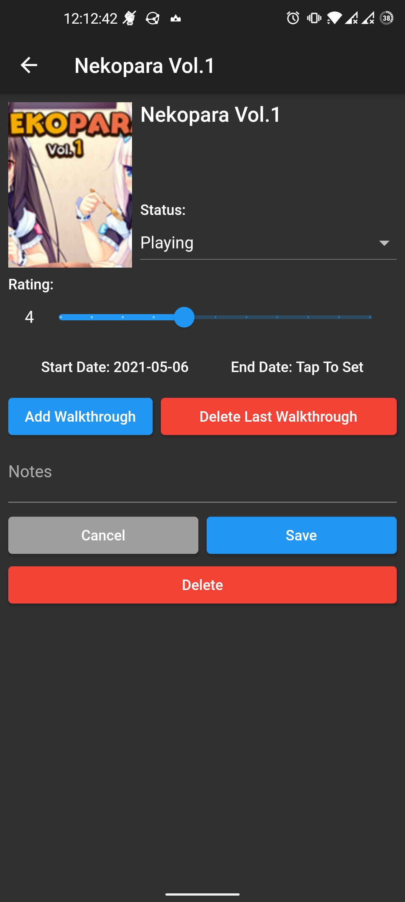
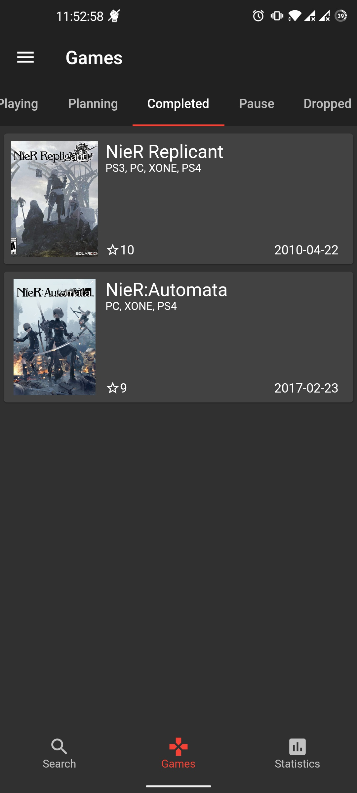
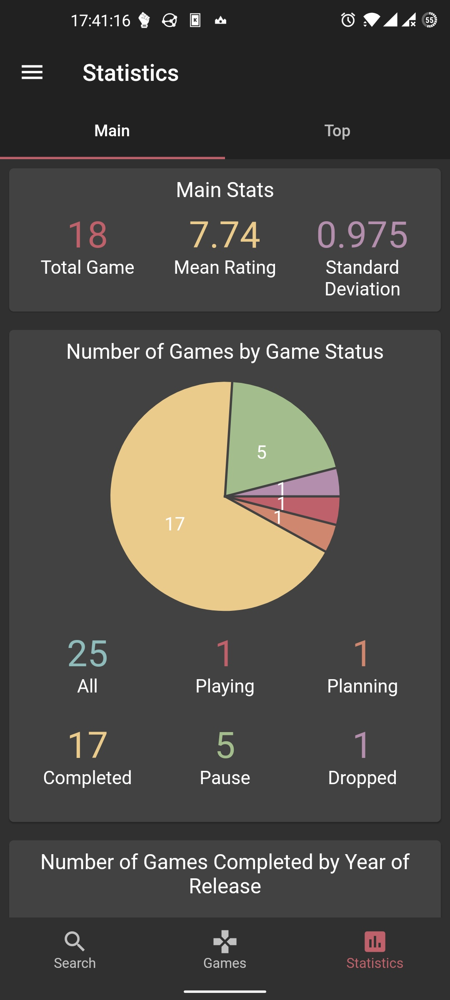
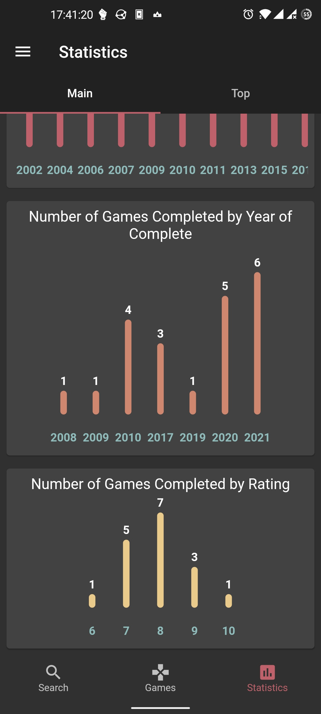
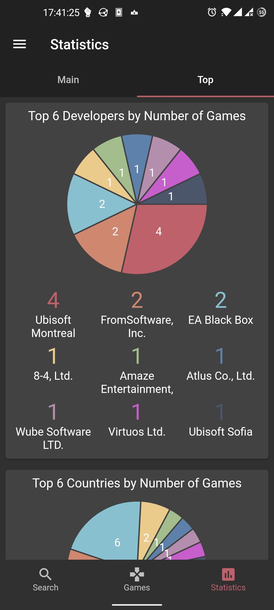
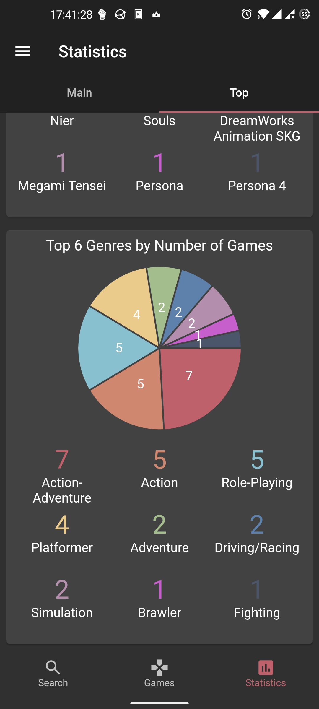
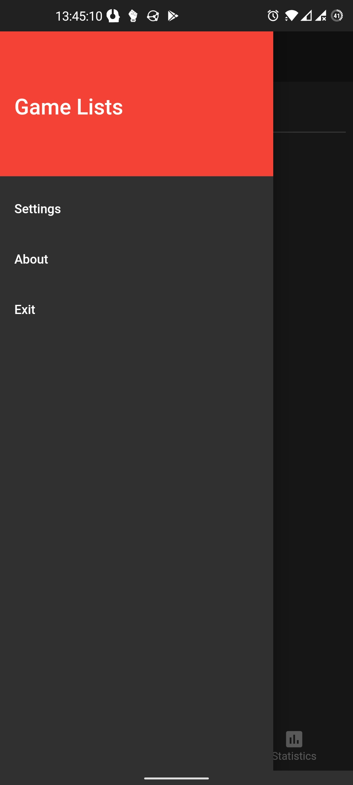
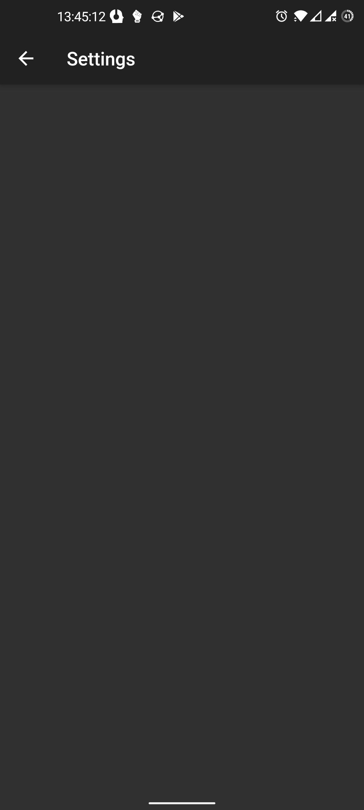
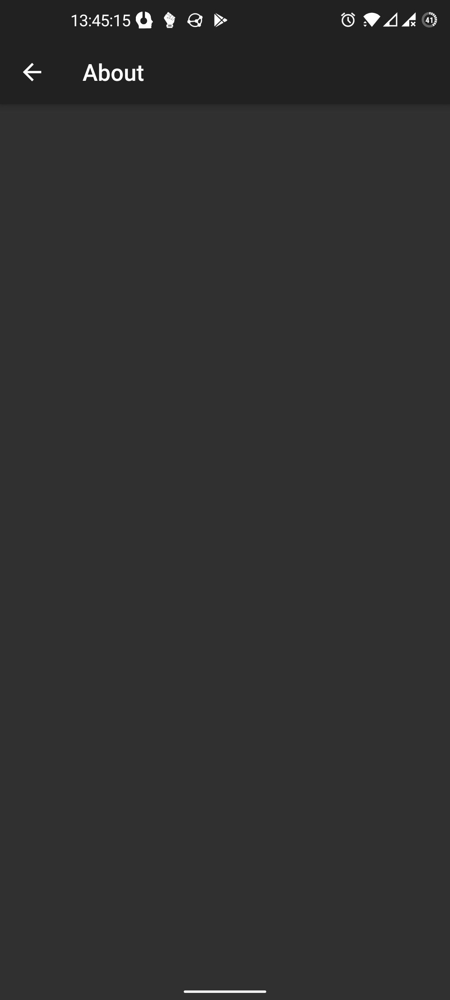

# Game List

The app for tracking what you're playing.

## Usage
1. Install and setup first [game_lists_server](https://github.com/IceArrow256/game_lists_server).
2. Install [Flutter](https://flutter.dev/docs/get-started/install).
3. Clone project:
~~~
$ git clone https://github.com/IceArrow256/game_lists.git
~~~
4. Build & run:
~~~
$ flutter run
~~~

## Screenshots

  
Click Me

## License

This project is licensed under the [MIT License](LICENSE).

## Thanks
- [Giant Bomb](https://www.giantbomb.com) for games data.